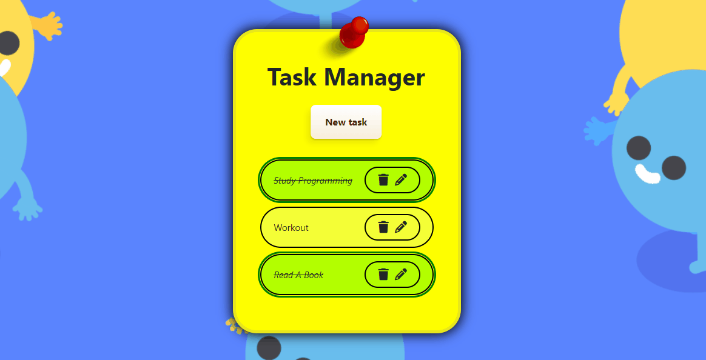

<h1 align="center"> Task Manager</h1>


------

## About The Project

> *Se você quiser ler a versão em português 🇧🇷, <a href="/READMEptbr.md">clique aqui</a>*

Welcome! 

This is Task Manager Project, a fun and useful FullStack application, which uses Java Spring Boot, Angular and PostgreSQL as the main technologies to build the API! Add, update and delete your daily tasks. Scroll down to see more details!

### Built with

* Front-end
  * HTML / SCSS / TS
  * Bootstrap 5
  * Angular 19 

* Back-end
  * Java Spring Boot
  * PostgreSQL
  * Maven
  * Swagger API
    * Tests
      * JUnit & Mockito
    * Logging
      * SLF4J
  

### Swagger Documentation

To access Task Manager documentation in Swagger, go to:

```
localhost:8080/taskmanager-swagger
```


## How to use

#### Back-end *(port 8080)*

```
# Clone repository
git clone https://github.com/Kaique-Apolinario/task-manager.git

# Enter in the directory in your IDE
cd ./Back-end

# Execute it
./mvnw spring-boot:run
```

#### Front-end *(port 4200)*

```
# Clone repository
git clone https://github.com/Kaique-Apolinario/task-manager.git

# Enter in the directory in your IDE
cd ./Front-end

# Install all of the dependencies
npm install

# Execute it
ng serve --o
```


## Prerequisites

* Java 17+
* Maven
* Node.js
* IDE, such as VS Code and Eclipse/IntelliJ IDEA
* PostgreSQL (If you don't have it, there's an in-memory database (H2) configuration in applications.properties)


## Features

#####  Create task


You can insert all of the tasks you need to do in a day quickly.

##### Update task's name


You can also edit the name of a task. OBS: The name of the task must not be empty!

#####  Finish task


Double-click to mark a task as finished! Do the same to unmark it.

##### Delete task


Delete a task by clicking in the trash icon on the right.

######  Responsiveness


## How to contribute

1. Fork it (https://github.com/Kaique-Apolinario/task-manager/fork)
2. Create your feature branch (`git checkout -b feature/name`)
3. Commit your changes (`git commit -am 'Add some changes'`)
4. Push to the branch (`git push origin feature/name`)
5. Create a new **Pull Request**!

## License 

[](https://github.com/Kaique-Apolinario/task-manager/blob/main/LICENSE) 

Code under MIT License.

## Author and Contact
<table>
  <tbody>
    <tr>
      <td align="center" valign="top" width="15%">
          
          <br />
          <sub>
              <b>Kaique Apolinário 🙋‍♂️👨‍💻 </b>
          </sub>
          <br>
          <sub>
           <a href="https://www.linkedin.com/in/kaique-apolinario/">
              
           </a>
          </sub>
</td>
    </tr>
  </tbody>
  </table>


