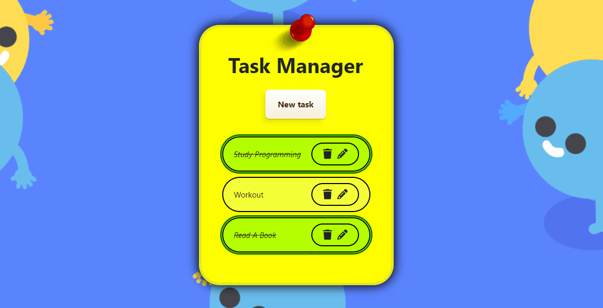

<h1 align="center"> Task Manager</h1>


------

## Sobre o Projeto

Bem-vindo!

Este é o projeto Gerenciador de Tarefas, uma aplicação FullStack divertida e útil, que usa Java Spring Boot, Angular e PostgreSQL como principais tecnologias para construir a API! Adicione, atualize e exclua suas tarefas diárias. Role para baixo para ver mais detalhes!

### Construído com

- Front-end
  - HTML / SCSS / TS
  - Bootstrap 5
  - Angular 19
- Back-end
  - Java Spring Boot
  - PostgreSQL
  - Maven
  - Swagger API
    - Testes
      - JUnit & Mockito
    - Log
      - SLF4J

### Documentação Swagger

Para acessar a documentação do Gerenciador de Tarefas no Swagger, vá para:

```
localhost:8080/taskmanager-swagger
```


## Como usar

#### Back-end *(port 8080)*

```
# Clone o repositório
git clone https://github.com/Kaique-Apolinario/task-manager.git

# Entre no diretório no seu IDE
cd ./Back-end

# Execute o projeto
./mvnw spring-boot:run
```

#### Front-end *(port 4200)*

```
# Clone o repositório
git clone https://github.com/Kaique-Apolinario/task-manager.git

# Entre no diretório no seu IDE
cd ./Front-end

# Instale todas as dependências
npm install

# Execute o projeto
ng serve --o
```


## Pré-requisitos

- Java 17+
- Maven
- Node.js
- IDE, como VS Code ou Eclipse/IntelliJ IDEA
- PostgreSQL (Se não tiver, há a configuração para banco de dados em memória H2 em applications.properties)


## Funcionalidades

#####  Criar tarefa


Você pode inserir rapidamente todas as tarefas que precisa fazer em um dia.

##### Atualizar nome da tarefa


Você também pode editar o nome de uma tarefa. OBS: O nome da tarefa não pode ficar vazio!

##### Finalizar tarefa


Dê um clique duplo para marcar uma tarefa como concluída! Faça o mesmo para desmarcá-la.

##### Delete task


Exclua uma tarefa clicando no ícone de lixeira à direita.

###### Responsividade


## Como contribuir

1. Faça um fork (https://github.com/Kaique-Apolinario/task-manager/fork)
2. Crie sua branch de feature (`git checkout -b feature/nome`)
3. Faça commit das suas alterações (`git commit -am 'Adicionei algumas alterações'`)
4. Envie para a branch (`git push origin feature/nome`)
5. Crie um novo **Pull Request**!

## Licença

[](https://github.com/Kaique-Apolinario/task-manager/blob/main/LICENSE) 

Código sob a licença MIT.

## Desenvolvedor and Contato
<table>
  <tbody>
    <tr>
      <td align="center" valign="top" width="15%">
          
          <br />
          <sub>
              <b>Kaique Apolinário 🙋‍♂️👨‍💻 </b>
          </sub>
          <br>
          <sub>
           <a href="https://www.linkedin.com/in/kaique-apolinario/">
              
           </a>
          </sub>
</td>
    </tr>
  </tbody>
  </table>


